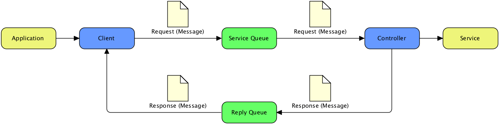
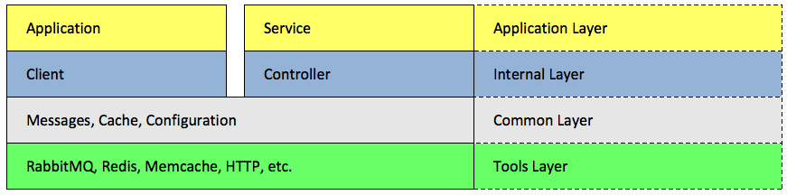

[](https://travis-ci.org/PuzzleFlow/tochtli)
[](http://badge.fury.io/rb/tochtli)

# What's Tochtli?

Tochtli is a set of conventions and tools that simplifies the implementation of components communicating over the RabbitMQ broker.
  Internally it depends on [bunny](https://github.com/ruby-amqp/bunny) gem.

## Idea



The communication between application and service looks like on the above picture.
  The _application_ calls the _client_ (regular object) methods which expose the _service API_. 
  The _request_ (a message) is created and sent by the _client_ to the _service queue_ (dedicated queue per service controller).
  _RabbitMQ_ is used as a message broker and delivers the _request_ to the _service controller_.
  The _controller_ implements the actions that are performed on the _request_ and may result in the _response_.
  The _response_ message is published on the _reply queue_ (private for a client connection). 
  The _client_ receives the _response_ and returns the expected result to the _application_.
  The client methods can be implemented in the blocking and non-blocking (asynchronous) way.

## Layers
  


The stable service interface really helps to reduce costs of a inevitable change that should only affect the internal implementation.
   In the proposed above layered structure the application interacts only with the public client class methods.
   It's not very hard to implement client methods in a such way that they will allow for future changes which won't cause compatibility issues.
   The expected resistance on the service API changes is a reason way application has no access to the messages definition.
   Only clients and service controllers operate on the message layer (the common layer).
   The bottom layer contains tools that allow for communication between the client and the server.
   There is an option for the message broker agnosticism in the future, because client and service implementation should not directly depend on the particular tool (ex. bunny).

# What's next?

Read more about Tochtli and go through the tutorial on [Tochtli homepage](http://puzzleflow.github.io/tochtli).

# Tests

Run rabbitmq using foreman:

```
bundle exec foreman start
```

In another shell run tests:

```
bundle exec rake test
```

# Contributing

- Fork the project.
- Make your feature addition or bug fix.
- Add tests for it. This is important so I don't break it in a future version unintentionally.
- Send me a pull request.

# License

Released under the MIT license.
